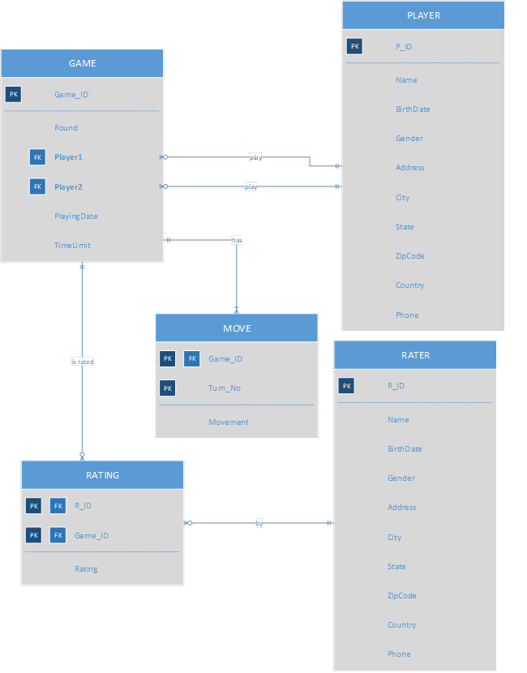

# This is a project I did in the class DATABASE DESIGN.
See the pdf file for the documented details.
# The design of the database

# Software requirement to open files:
* Microsoft office suite:
    * Word for docx file. This file has the same details as the pdf file.
    * Access for accde file. This file has all tables, queries, forms, reports, macros, and VB.A code too.
* Microsoft Visio for the vsdx file. This file has UML diagrams.
* Adobe Acrobat reader for the pdf file
